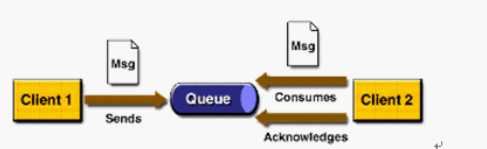
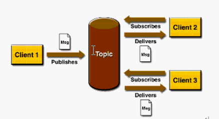
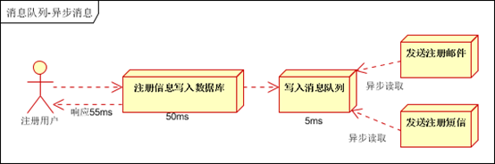

## Java操作队列    
### ActiveMQ的两种模式
#### 一、点对点（P2P）模式
##### 1.	P2P模式图 
  

黄色Client1表示发送者(Sender)、黄色Client2表示接收者(Receiver)、蓝色表示消息队列（Queue）

功能： 每个消息都被发送到一个特定的队列，接收者从队列中获取消息。队列保留着消息，直到他们被消费或超时。

##### 2. P2P的特点
* 每个消息只有一个消费者（Consumer）(即一旦被消费，消息就不再在消息队列中)
* 发送者和接收者之间在时间上没有依赖性，也就是说当发送者发送了消息之后，不管接收者有没有正在运行，它不会影响到消息被发送到队列
* 接收者在成功接收消息之后需向队列应答成功

##### 3. P2P应用场景

#### 二、发布与订阅（Pub/Sub）模式
##### 1.	P2P模式图 
 

黄色Client1表示发布者（Publisher）、黄色Client2和Client2表示订阅者（Subscriber）、棕色表示主题消息队列（Queue）

功能：客户端将消息发送到主题。多个发布者将消息发送到Topic,系统将这些消息传递给多个订阅者

##### 2. Pub/Sub的特点
* 每个消息可以有多个消费者
* 发布者和订阅者之间有时间上的依赖性。针对某个主题（Topic）的订阅者，它必须创建一个订阅者之后，才能消费发布者的消息，而且为了消费消息，订阅者必须保持运行的状态。
* 为了缓和这样严格的时间相关性，JMS允许订阅者创建一个可持久化的订阅。这样，即使订阅者没有被激活（运行），它也能接收到发布者的消息。
* 如果你希望发送的消息可以不被做任何处理、或者被一个消息者处理、或者可以被多个消费者处理的话，那么可以采用Pub/Sub模型

##### 3. Pub/Sub应用场景
 

### SpringBoot整合ActiveMQ
   [暂未开放](http://www.rabbitmq.com/getstarted.html)
 
 SpringBoot整合ActiveMQ有如下知识点
