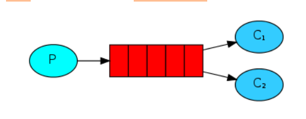
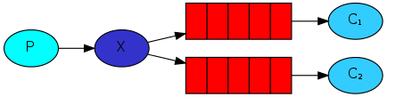
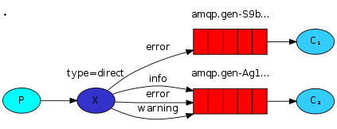
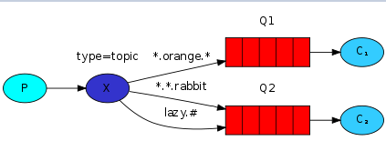

## Java操作队列
     
### RabbitMQ的五种模式（RPC忽略）
[详细网址](http://www.rabbitmq.com/getstarted.html)
### 一、简单队列（点对点模式）
  
 
P表示为生产者 、C表示为消费者、红色表示队列。

功能：一个生产者P发送消息到队列Q,只能允许一个消费者C接收

消费者获取消息方式：
* 推：消费者已经启动，建立长连接，一旦生产者向队列投递消息，mq立马会推送给消费者
* 取：消费者未启动，生产者先投递消息到队列进行缓存，这个时候回消费者再启动的时候回，就会向队列中获取消息

#####注意：如果消费者是集群的话，会进行均摊消费。对于这种方式缺点很明显，比如集群的消费者服务器性能不同，这样大大的降低消费力度。

### 二、工作（公平）队列模式

  

 P表示为生产者 、C表示为消费者 红色表示队列。

功能：一个生产者对应多个消费者,但是只能有一个消费者获得消息
##### 公平队列原理：队列服务器向消费者发送消息的时候，消费者采用手动应答模式，队列服务器必须收到消费者发送ack（应答模式）结果通知，才会继续发送下一个消息
应答模式：为了确保消息不会丢失，RabbitMQ支持消息应答。消费者发送一个消息应答，告诉RabbitMQ这个消息已经接收并且处理完毕了。RabbitMQ就可以删除它了。
如果一个消费者挂掉却没有发送应答，RabbitMQ会理解为这个消息没有处理完全，然后交给另一个消费者去重新处理。这样，你就可以确认即使消费者偶尔挂掉也不会丢失任何消息了。

无消息超时限制；只有当消费者挂掉时，RabbitMQ才会重新投递。即使处理一条消息会花费很长的时间。

消息应答是默认打开的。我们通过显示的设置autoAsk=true关闭这种机制。现即自动应答开，一旦我们完成任务，消费者会自动发送应答。通知RabbitMQ消息已被处理，可以从内存删除。如果消费者因宕机或链接失败等原因没有发送ACK（不同于ActiveMQ，在RabbitMQ里，消息没有过期的概念），则RabbitMQ会将消息重新发送给其他监听在队列的下一个消费者。

### 三、发布/订阅模式

  

P表示为生产者 、C表示为消费者、红色表示队列、X表示扇型交换机。

功能：一个消费者将消息首先发送到交换器,交换器绑定多个队列,然后被监听该队列的消费者所接收并消费

这个可能是消息队列中最重要的队列了，其他的都是在它的基础上进行了扩展。

功能实现：一个生产者发送消息，多个消费者获取消息（同样的消息），包括一个生产者，一个交换机，多个队列，多个消费者。
 思路解读（重点理解）： 
* 一个生产者，多个消费者
* 每一个消费者都有自己的一个队列
* 生产者没有直接发消息到队列中，而是发送到交换机
* 每个消费者的队列都绑定到交换机上
* 消息通过交换机到达每个消费者的队列

该模式就是Fanout Exchange（扇型交换机）将消息路由给绑定到它身上的所有队列
以用户发邮件案例讲解
#####注意：交换机没有存储消息功能，如果消息发送到没有绑定消费队列的交换机，消息则丢失。

 ##### 交换机的作用：生产者发送消息不会向传统方式直接将消息投递到队列中，而是先将消息投递到交换机中，在由交换机转发到具体的队列，队列在将消息以推送或者拉取方式给消费者进行消费，这和我们之前学习Nginx有点类似。

### 四、路由模式

  

P表示为生产者 、C表示为消费者、红色表示队列、X表示直连交换机。

功能：生产者发送消息到交换机并指定一个路由key，消费者队列绑定到交换机时要制定路由key（key匹配就能接受消息，key不匹配就不能接受消息）

例如：我们可以把路由key设置为insert ，那么消费者队列key指定包含insert才可以接收消息，消费者队列key定义为update或者delete就不能接收消息。很好的控制了更新，插入和删除的操作。

### 五、通配符模式
  

P表示为生产者 、C表示为消费者、红色表示队列、X表示主题交换机。

说明：此模式实在路由key模式的基础上，使用了通配符来管理消费者接收消息。生产者P发送消息到交换机X，type=topic，交换机根据绑定队列的routing key的值进行通配符匹配；

符号#：匹配一个或者多个词lazy.# 可以匹配lazy.irs或者lazy.irs.cor
符号*：只能匹配一个词lazy.* 可以匹配lazy.irs或者lazy.cor

### 六、交换机作用

 交换机的作用根据具体的路由策略分发到不同的队列中，交换机有四种类型。
  * Direct exchange（直连交换机）是根据消息携带的路由键（routing key）将消息投递给对应队列的
  * Fanout exchange（扇型交换机）将消息路由给绑定到它身上的所有队列
  * Topic exchange（主题交换机）队列通过路由键绑定到交换机上，然后，交换机根据消息里的路由值，将消息路由给一个或多个绑定队列
  * Headers exchange（头交换机）类似主题交换机，但是头交换机使用多个消息属性来代替路由键建立路由规则。通过判断消息头的值能否与指定的绑定相匹配来确立路由规则。 
header交换器和direct交换器完全一致,但是性能却差很多,因此基本上不会用到该交换器,这不做详细介绍.
